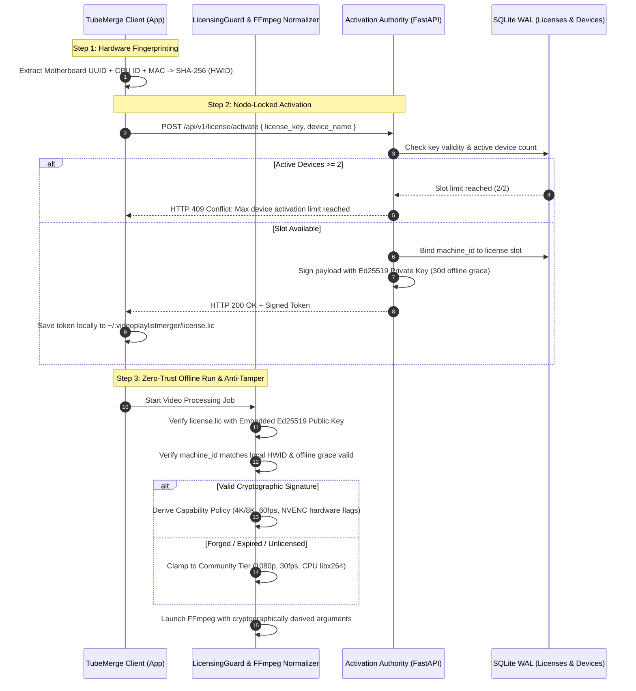

# TubeMerge 🎬
> **Production-Grade Desktop Application for YouTube Playlist Concatenation & Normalization**  
> *Official Domain: [videoplaylistmerger.com](https://videoplaylistmerger.com)*

[](https://www.python.org/)
[](https://fastapi.tiangolo.com/)
[](https://react.dev/)
[](https://www.typescriptlang.org/)
[](https://tailwindcss.com/)
[](https://ed25519.cr.yp.to/)
[](https://sqlite.org/wal.html)

TubeMerge is a modern, high-performance desktop media utility that downloads and stitches arbitrary YouTube playlists into a single, broadcast-quality MP4 file. It features an automated audio clock synchronization engine, master canvas normalization, chapter embedding, an Ed25519 cryptographic node-locking anti-piracy licensing system, and a YouTube Studio-inspired creator interface.

---

## 🚀 Key Features

- **Decoupled Local Sidecar Architecture**: High-speed Python backend (FastAPI + SQLite WAL) paired with a React 19 + TypeScript + Tailwind CSS desktop UI.
- **Smart Audio & Video Normalization**: Scales varying playlist resolutions to a unified master canvas (1080p, 4K 60FPS, or 8K), enforces constant framerates (CFR), pads letterboxing seamlessly, and resamples all audio tracks to 44.1kHz AAC stereo.
- **Automated Chapter Demuxing**: Automatically generates and embeds MP4 chapter markers from individual YouTube clip titles and millisecond-accurate segment timestamps.
- **Asymmetric Anti-Piracy Licensing (Ed25519)**:
  - Asymmetric cryptographic signature validation using Ed25519 (`<base64_payload>.<base64_sig>`).
  - Zero-trust offline verification with embedded master public key.
  - Cross-platform hardware fingerprinting (DMI product UUID, CPU ID, MAC address).
  - Node-locked device slot management (up to 2 authorized workstations per license key).
  - 30-day periodic offline grace period.
  - Anti-tamper capability policies preventing single boolean `if (isPro)` bypasses.
- **High-Performance SQLite WAL Database**: Zero-network-socket latency (< 0.2ms) handling license activations, hardware node-locks, and privacy-preserving request volume quotas.
- **YouTube Studio Creator Profile**: Fully styled dark-mode account management with 3 persistent tabs: *Overview* metrics, *License & Plan* comparison/activation, and *Usage Analytics*.

---

## 💳 3-Tier Business & Pricing Strategy

| Tier | Price Point | Features & Capabilities |
| :--- | :--- | :--- |
| **Free Community** | **$0** (Free Forever) | Acquisition funnel. Up to 3 merges / day, 1080p max resolution, CPU encoding, 1 device workstation. |
| **Creator Pro (Pass)** | **$4.99 / mo** *or* **$29 / yr** | Flexible project pass. Unlimited daily merges, 4K 60FPS & 8K rendering, GPU acceleration (NVENC / QuickSync), multi-threaded download engine, 2 workstations. |
| **Pro Lifetime (Hero Offer)** | **$49 One-Time** | **Highest-converting tier**. "Pay once, own forever" with zero recurring fees. Unlimited merges, 4K 60FPS & 8K rendering, full GPU acceleration, 3 workstations, and free lifetime updates. |

---

## 🏗 System Architecture & Directory Layout

```
quick-oppenheimer/
├── assets/                                      # Branded assets & studio panoramic artwork
│   ├── banner.jpg                               # "We Build to Make Your Life Easier" banner
│   └── logo.png                                 # TubeMerge identity badge
├── docs/                                        # Architecture & engineering specifications
│   └── PRODUCTION_ISSUES_AND_SOLUTIONS.md       # Technical issue resolution post-mortem
├── frontend/                                    # Modern React 19 + TypeScript + Vite SPA
│   ├── src/
│   │   ├── components/
│   │   │   ├── ui/                              # Primitive components (Button, Badge, Spinner)
│   │   │   ├── layout/                          # Header, Sidebar, Navigation
│   │   │   └── merge/                           # Action panels, progress spotlight
│   │   ├── views/
│   │   │   ├── EmptyStateView.tsx               # "Power Up Your Merges" visual feature card
│   │   │   ├── ProfileView.tsx                  # YouTube Studio-style profile & licensing tab
│   │   │   └── DiscoveryView.tsx                # Playlist inspector view
│   │   ├── hooks/useMergeApp.ts                 # Unified application state manager
│   │   └── services/api.ts                      # Strongly typed REST client
│   └── dist/                                    # Pre-compiled production bundle (zero-npm deployment)
├── src/
│   └── tubemerge/                               # Python Backend (Django-Style Modular Apps)
│       ├── core/                                # Application settings, paths, & DI container
│       ├── db/                                  # SQLite WAL connection manager & auto-migrations
│       ├── apps/
│       │   ├── binaries/                        # FFmpeg & yt-dlp locator & auto-installer
│       │   ├── playlists/                       # YouTube metadata & master canvas probing
│       │   ├── merger/                          # FFmpeg normalizer, concat stitcher, MergeEngine
│       │   ├── licensing/                       # Ed25519 crypto, node-locking, HWID, telemetry
│       │   │   ├── services/
│       │   │   │   ├── crypto_service.py        # Ed25519 signing & offline token verification
│       │   │   │   ├── fingerprint_service.py   # Cross-platform hardware ID generator
│       │   │   │   ├── guard_service.py         # Anti-tamper capability policy derivation
│       │   │   │   ├── license_service.py       # Node-locking & device slot management
│       │   │   │   └── telemetry_service.py     # Privacy-preserving request counter
│       │   │   ├── controllers/license_controller.py
│       │   │   └── routes.py                    # /api/v1/license/* & /api/license/*
│       │   └── system/                          # Native OS file integration (xdg-open / explorer)
│       ├── server/app.py                        # FastAPI application mounting SPA and routers
│       └── app.py                               # PyWebView desktop window / browser launcher
├── tests/                                       # OOP unit and integration test suite
├── main.py                                      # Primary application entrypoint
├── pyproject.toml                               # PEP 621 packaging metadata
└── requirements.txt                             # Python dependencies
```

---

## 🔒 Cryptographic Licensing & Anti-Piracy Flow



---

## 🛠 Quick Start

### 1. Prerequisites
- **Python 3.10+** (Python 3.10, 3.11, 3.12, 3.13, 3.14 supported)
- **FFmpeg & yt-dlp** (Auto-detected from PATH or automatically downloaded on first launch to `~/.videoplaylistmerger/bin/`)

### 2. Installation
```bash
git clone https://github.com/<your-username>/tubemerge.git
cd tubemerge

# Optional: Create and activate virtual environment
python3 -m venv .venv
source .venv/bin/activate

# Install requirements
pip install -r requirements.txt
```

### 3. Running the Application
```bash
python3 main.py
```
*The app will automatically launch a native desktop GUI window or open in your default browser at `http://127.0.0.1:7842`.*

---

## 💻 Frontend Development (Optional)

If modifying the React user interface:
```bash
cd frontend

# Install Node dependencies
npm install

# Start Vite live development server
npm run dev

# Compile production bundle into frontend/dist/
npm run build
```

---

## 🧪 Automated Testing

Run the comprehensive unit test and anti-piracy security suites:
```bash
# Run backend service unit tests
pytest tests/

# Run cryptographic anti-piracy & node-locking security suite
python3 -c "from tubemerge.apps.licensing.services.crypto_service import CryptoService; print('Ed25519 OK')"
```

---

## 📄 License
Proprietary / Commercial software. Core source code distributed under project license terms.  
*Copyright © 2026 TubeMerge Team. All rights reserved.*
