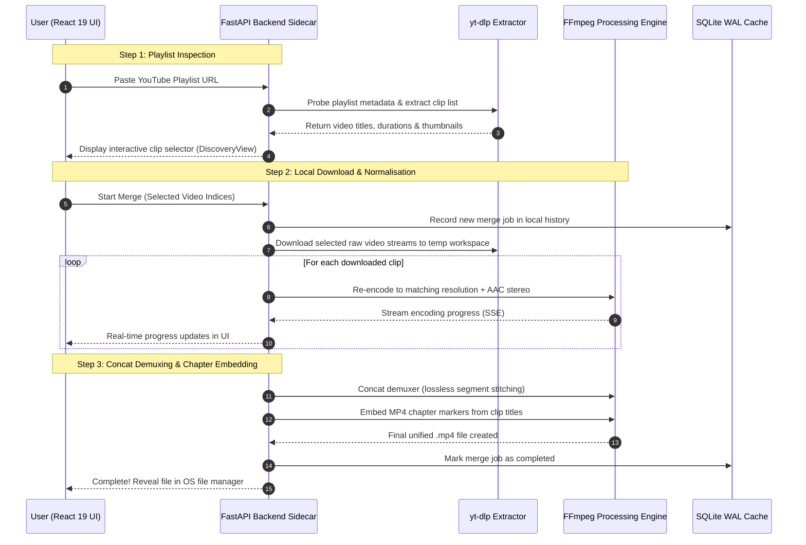

# TubeMerge 🎬
> **Production-Grade Desktop Application for YouTube Playlist Concatenation & Normalization**  
> *Official Domain: [tubemerger.com](https://tubemerger.com)*

[](https://www.python.org/)
[](https://fastapi.tiangolo.com/)
[](https://react.dev/)
[](https://www.typescriptlang.org/)
[](https://tailwindcss.com/)
[](https://opensource.org/licenses/MIT)
[](https://sqlite.org/wal.html)
[](https://aptabase.com/)

TubeMerge is a modern, high-performance desktop media utility that downloads and stitches arbitrary YouTube playlists into a single, broadcast-quality MP4 file. It features an automated audio clock synchronization engine, master canvas normalization, chapter embedding, privacy-preserving telemetry via Aptabase, and a sleek YouTube Studio-inspired dark mode interface — **100% free and open source**.

---

## Key Features

- **Decoupled Local Sidecar Architecture**: High-speed Python backend (FastAPI + SQLite WAL) paired with a React 19 + TypeScript + Tailwind CSS desktop UI served locally via PyWebView.
- **Smart Video Normalization**: Automatically scales and pads varying playlist resolutions to a uniform master canvas (CRF 21, libx264), enforces constant framerates, and eliminates aspect ratio jumps.
- **Balanced Audio Synchronization**: Re-encodes audio tracks to uniform 44.1 kHz AAC stereo so audio levels don't drop or distort across merged segments.
- **Automated Chapter Demuxing**: Automatically generates and embeds seekable MP4 chapter markers from individual YouTube clip titles.
- **100% Local & Private Processing**: yt-dlp and FFmpeg run directly on your machine. No raw playlist URLs, titles, or video streams are ever uploaded to cloud servers.
- **High-Performance SQLite WAL Database**: Thread-safe, non-blocking local storage handling merge job history and queue management with sub-millisecond query latency.
- **Completely Free & Unlimited**: Zero paywalls, no device limits, no subscription tiers, and no license keys required.

---

## Processing Pipeline



---

## System Architecture & Directory Layout

```
quick-oppenheimer/
├── assets/                                      # Branded assets & studio panoramic artwork
│   ├── banner.jpg                               # "We Build to Make Your Life Easier" banner
│   └── logo.png                                 # TubeMerge identity badge
├── docs/                                        # Architecture & engineering specifications
│   └── PRODUCTION_ISSUES_AND_SOLUTIONS.md       # Technical issue resolution post-mortem
├── frontend/                                    # Modern React 19 + TypeScript + Vite SPA
│   ├── src/
│   │   ├── components/
│   │   │   ├── ui/                              # Primitive components (Button, Badge, Spinner)
│   │   │   ├── layout/                          # Header, Sidebar, Navigation
│   │   │   └── merge/                           # Action panels, ProgressSpotlight, FloatingActionBar
│   │   ├── views/
│   │   │   ├── EmptyStateView.tsx               # 3x2 Feature showcase grid & GitHub Star CTA
│   │   │   ├── DiscoveryView.tsx                # Playlist clip inspector & selector
│   │   │   ├── HistoryView.tsx                  # Local SQLite merge history log
│   │   │   └── QueuesView.tsx                   # Background merge queue view
│   │   ├── hooks/useMergeApp.ts                 # Unified application state manager
│   │   └── services/api.ts                      # Strongly typed REST client & SSE subscriber
│   └── dist/                                    # Pre-compiled production bundle
├── src/
│   └── tubemerge/                               # Python Backend (Modular Apps)
│       ├── core/
│       │   ├── settings.py                      # Application settings, paths, & canvas presets
│       │   └── config.py                        # Feature flags, Aptabase key & monetization settings
│       ├── db/
│       │   └── connection.py                    # SQLite WAL connection manager & auto-migrations
│       ├── apps/
│       │   ├── binaries/                        # FFmpeg & yt-dlp locator & auto-installer
│       │   ├── playlists/                       # YouTube metadata & master canvas probing
│       │   ├── merger/                          # FFmpeg normalizer, concat stitcher, MergeEngine
│       │   │   ├── services/
│       │   │   │   ├── engine.py                # Download → normalise → stitch pipeline
│       │   │   │   ├── normalizer.py            # FFmpeg per-clip re-encode (libx264 + AAC)
│       │   │   │   └── stitcher.py              # FFmpeg concat + chapter metadata embed
│       │   │   ├── controllers/merge_controller.py
│       │   │   └── routes.py                    # /api/start-merge, /api/progress (SSE), /api/cancel
│       │   ├── history/                         # Local merge job history management
│       │   ├── queues/                          # Merge job queue handling
│       │   ├── system/                          # Native OS file integration (xdg-open / explorer)
│       │   └── telemetry/                       # Aptabase anonymous counter service
│       ├── server/app.py                        # FastAPI application mounting SPA and routers
│       └── app.py                               # PyWebView desktop window / browser launcher
├── website/                                     # Official Marketing Landing Page & Web Docs
│   ├── src/                                     # React + Tailwind CSS marketing site
│   ├── public/                                  # Static brand assets, sitemap & robots.txt
│   ├── vercel.json                              # Vercel deployment configuration (tubemerger.com)
│   └── package.json                             # Website build dependencies
├── tests/                                       # OOP unit and integration test suite
├── main.py                                      # Primary application entrypoint
├── pyproject.toml                               # PEP 621 packaging metadata
└── requirements.txt                             # Python dependencies
```

---

## Privacy-Preserving Analytics (Aptabase)

TubeMerge incorporates privacy-first, GDPR-compliant volumetric telemetry via [Aptabase](https://aptabase.com).

- **App Key**: `A-EU-1063594697`
- **Region**: EU (`https://eu.aptabase.com`)

### Privacy Guarantees

1. **Zero Personally Identifiable Information (PII)**: No usernames, IP addresses, device identifiers, or hardware fingerprints are collected.
2. **No URLs or Video Metadata**: YouTube URLs, playlist links, channel names, and video titles are **never transmitted** or logged.
3. **Clip Count Bucketing**: Raw numbers of selected clips are never sent; they are bucketed into generic categories (`small` for ≤ 20 clips, `large` for > 20 clips).
4. **Tracked Events**:
   - `app_started`: Anonymous ping on desktop app startup.
   - `playlist_merge_started`: Dispatched when a merge pipeline starts (with `size_bucket`).
   - `playlist_merge_completed`: Dispatched upon successful job finish (with duration bucket).

### Disabling Telemetry

Telemetry can be disabled at any time by setting `TELEMETRY_APP_KEY = ""` in `src/tubemerge/core/config.py`:

```python
# src/tubemerge/core/config.py
TELEMETRY_APP_KEY: str = ""  # Set to empty string to disable telemetry
```

---

## Future Monetization

TubeMerge is **100% free and unlimited**. All legacy proprietary licensing logic (Ed25519 signature checks, hardware fingerprinting, Stripe billing) has been completely removed.

Future monetization (when traffic scales) will rely on an optional ad-supported web redirect during the FFmpeg processing wait:

```python
# src/tubemerge/core/config.py
MONETIZATION_ACTIVE: bool = False  # Set to True to enable ad-supported redirect
PRODUCTION_WEB_URL: str = "https://tubemerger.com"
```

- When `False` (default): Processing progress displays natively within the desktop app window.
- When `True`: The user's default browser is opened to the web status page while FFmpeg executes locally in the background.

---

## 🛠 Quick Start

### 1. Prerequisites
- **Python 3.10+** (Python 3.10, 3.11, 3.12, 3.13, 3.14 supported)
- **Node.js 18+ & npm** (only needed if building frontend from source)
- **FFmpeg & yt-dlp** (Auto-detected from PATH or automatically downloaded on first launch to `~/.tubemerger/bin/`)

### 2. Installation
```bash
git clone https://github.com/hashamtanveer-41/tubemerger.git
cd tubemerger

# Optional: Create and activate virtual environment
python3 -m venv .venv
source .venv/bin/activate  # On Windows: .venv\Scripts\activate

# Install requirements
pip install -r requirements.txt
```

### 3. Running the Application
```bash
python3 main.py
```
*The app will automatically launch a native desktop GUI window or open in your default browser at `http://127.0.0.1:7842`.*

---

## 💻 Frontend Development (Optional)

If modifying the React user interface:
```bash
cd frontend

# Install Node dependencies
npm install

# Start Vite live development server
npm run dev

# Compile production bundle into frontend/dist/
npm run build
```

---

## 🧪 Automated Testing

Run the comprehensive unit test suite:
```bash
python3 -m unittest discover tests
```

---

## 📄 License
This project is licensed under the **[MIT License](LICENSE)** — free for personal and commercial use.  
*Copyright © 2026 TubeMerge Contributors.*
